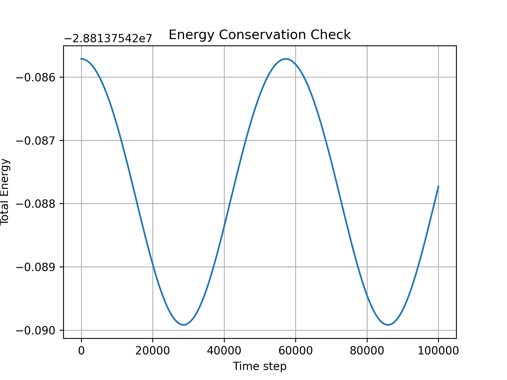

# Orbital Mechanics Simulation

This project simulates orbital motion using numerical integration methods and analyzes energy conservation over time.

## Overview

A two-body orbital system was modeled using Newton’s law of gravitation. The simulation computes position and velocity updates over time to produce a trajectory and evaluate system energy.

## Results

The simulation produces:

- A stable orbital trajectory
- Near-constant total energy (verifying numerical accuracy)

## Methods

- Numerical integration
- Position and velocity updates over time
- Energy calculation

## Technologies Used

- Python
- NumPy
- Matplotlib

## Visualizations

### Orbital Trajectory

### Energy Conservation

## Significance

This project demonstrates fundamental physics simulation and validates numerical methods through energy conservation.
