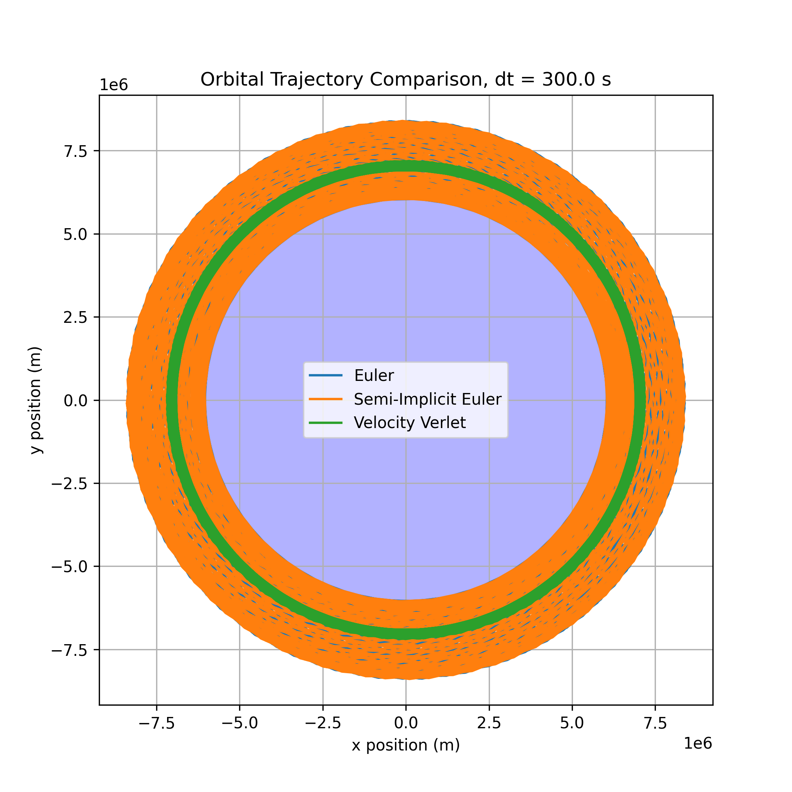
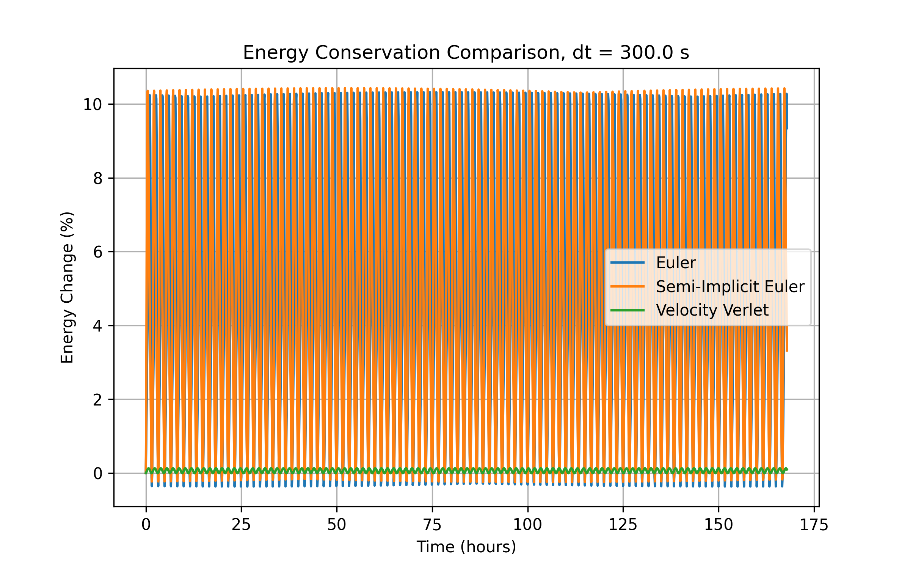
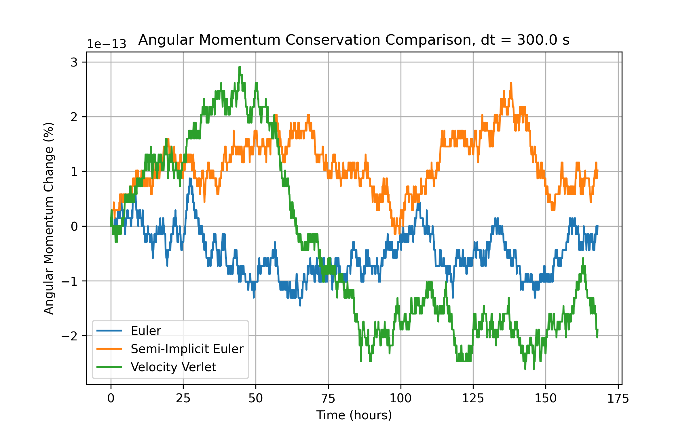
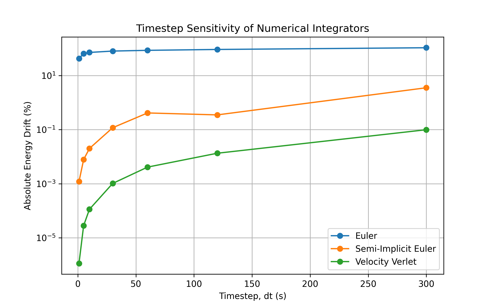
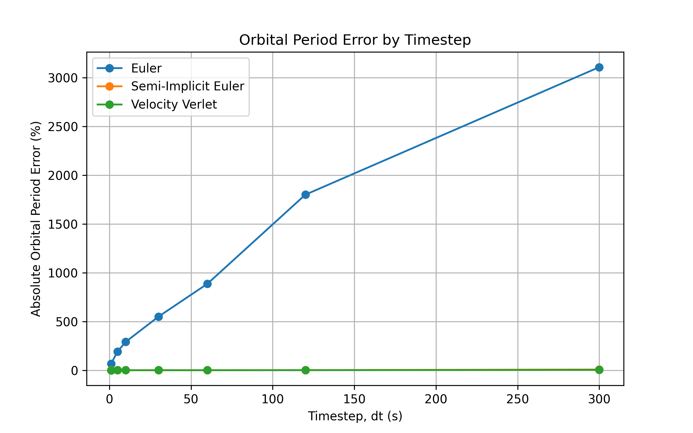
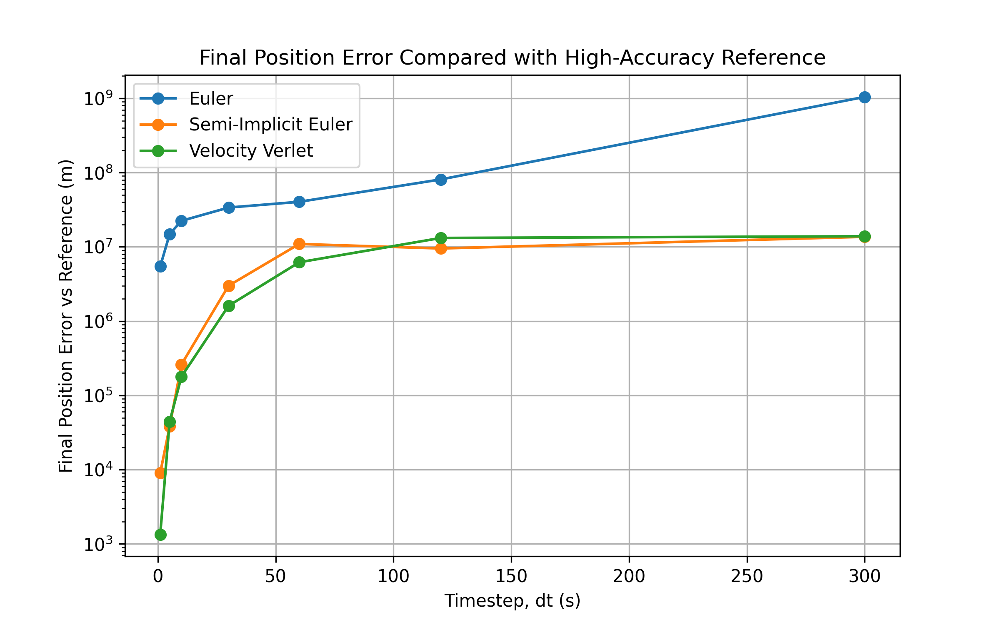

# Orbital Mechanics Simulation

This project compares three numerical integration methods for a two-body Earth orbit simulation. The goal is to test how timestep size affects orbital stability, energy conservation, angular momentum conservation, orbital period estimates, and final position error.

The simulation models a satellite moving under Earth's gravity using Python, NumPy, and Matplotlib. Each method is tested across timestep values from 1 s to 300 s over a seven-day simulation.

## Methods Compared

- Explicit Euler
- Semi-Implicit Euler
- Velocity Verlet

## Physics Model

The simulation uses a two-body Newtonian gravity model. Earth is treated as a fixed central mass, and the satellite is treated as a point mass. The acceleration is computed from

```text
a = -mu r / |r|^3
```

where `mu = G M`, `r` is the satellite position vector, `G` is the gravitational constant, and `M` is Earth's mass.

The model intentionally omits atmospheric drag, thrust, third-body gravity, Earth oblateness, and measurement noise. This keeps the project focused on numerical integration error rather than external perturbations.

## Numerical Methods

### Explicit Euler

The explicit Euler method updates position using the current velocity, then updates velocity using acceleration from the old position. This method is simple, but it can accumulate large energy and trajectory errors over long integrations.

### Semi-Implicit Euler

The semi-implicit Euler method updates velocity first, then updates position using the new velocity. This method often behaves better than explicit Euler for orbital problems because it tends to preserve qualitative orbital behavior more reliably.

### Velocity Verlet

Velocity Verlet updates position using current velocity and acceleration, then updates velocity using the average of the old and new accelerations. This method is commonly used for orbital and particle simulations because it has better conservation behavior over time.

## Error Metrics

The simulation computes:

- Energy drift
- Angular momentum drift
- Orbital period error
- Final position error compared with a high-accuracy reference simulation
- Runtime

The final position error is computed by comparing each method's final position to a high-resolution Velocity Verlet reference solution at the same final simulation time.

```text
position_error = |r_method_final - r_reference_final|
```

This is cleaner than comparing the final orbital radius to the starting radius because the orbit is not guaranteed to return to the same phase after exactly seven days.

## Installation

Clone the repository:

```bash
git clone https://github.com/sssuriset/orbital-mechanics-simulation.git
cd orbital-mechanics-simulation
```

Install dependencies:

```bash
python3 -m pip install numpy matplotlib
```

## How to Run

Run the simulation with:

```bash
python3 orbit.py
```

The script creates a `results/` folder and saves the CSV file and plots there.

## Output Files

| File | Description |
|---|---|
| `results/results.csv` | Numerical results for each method and timestep |
| `results/orbitcomparison.png` | Orbit trajectories for the selected timestep |
| `results/energycomparison.png` | Energy conservation comparison |
| `results/angmomcomparison.png` | Angular momentum conservation comparison |
| `results/timestepsensitivity.png` | Energy drift as timestep changes |
| `results/perioderror.png` | Orbital period error as timestep changes |
| `results/positionerror.png` | Final position error compared with reference solution |

## Key Result

The comparison shows that timestep size strongly affects orbital accuracy. Explicit Euler accumulates the largest drift, while Velocity Verlet gives the strongest conservation behavior and the smallest final-position error across the timestep sweep.

Exact values are saved in `results/results.csv` after running the script.

## Figures

### Orbit Comparison



### Energy Conservation



### Angular Momentum Conservation



### Timestep Sensitivity



### Period Error



### Final Position Error



## Limitations

This is an idealized two-body model. It does not include atmospheric drag, Earth's oblateness, solar or lunar gravity, propulsion, attitude dynamics, or sensor noise. The purpose is to isolate numerical integration behavior.

The reference solution is not an analytical truth solution. It is a high-resolution numerical solution, so it is only used as a practical benchmark for comparing lower-resolution runs.

## Future Work

Possible extensions include:

- Compare against an analytical Kepler orbit solution
- Add adaptive timestep integration
- Add Runge-Kutta methods
- Test elliptical and highly eccentric orbits
- Track phase error over multiple orbital periods
- Add orbital elements such as semi-major axis, eccentricity, and specific angular momentum
- Add unit tests for energy, angular momentum, and period calculations
